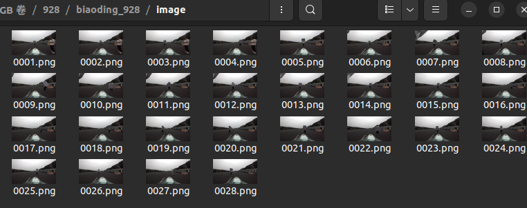
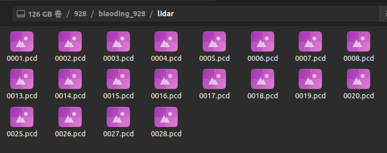

这里是对车队相机雷达内外参标定的相关工具
接下来我将会一一介绍：
1、calib_ws
这个是一个手动标定的工具，具体的环境配置和使用方法我均放在语雀：https://dianracing.yuque.com/fsd/xw3176/boqpg5rvqp61lrzs#hrRAC
进入“手动调参”部分即可看到

2、ros2_bag_exporter
这是一个将rosbag包转为相机、雷达等帧的功能包。
使用只需要进入biaoding_in_out/ros2_bag_exporter/config,然后修改yaml里面的路径即可

3、match_name.py
这是一个对“ros2_bag_exporter”输出的雷达帧和相机帧的匹配脚本
输出的雷达帧和相机帧的名称均由时间戳组成，而实际标定的时候我们需要挑出相机的关键帧，然后找对应的雷达关键帧。这个脚本属于是简化了寻找雷达帧+重命名的过程，最后输出的效果如图所示

具体的配置请看配置区

4、ROI.py
就是对雷达的裁剪工具，你可以划定一个范围
